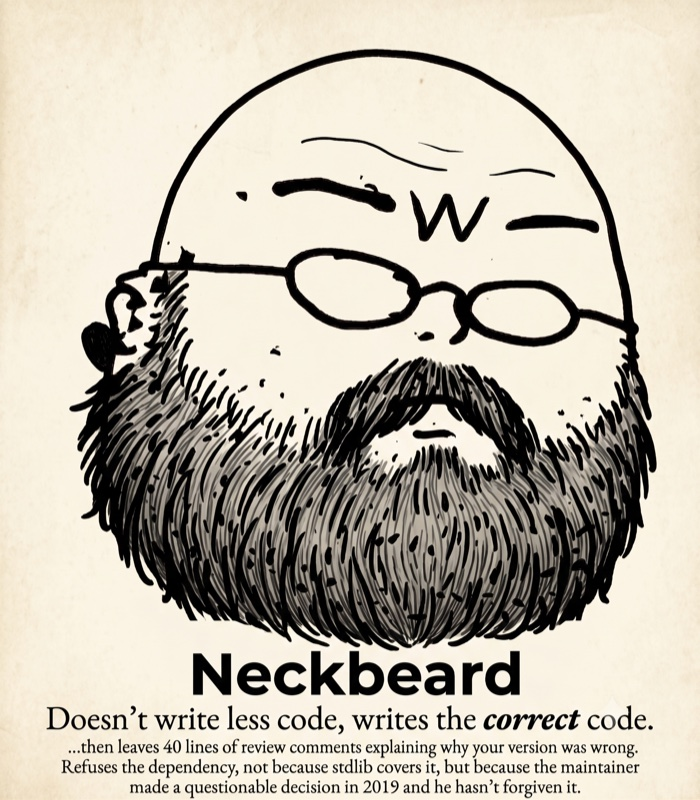

# Hermes skills

Installable [Hermes](https://nousresearch.com/) skills. Tap this repo, then browse / install:

```bash
hermes skills tap add MahdiHedhli/skills
hermes skills search scope-first
hermes skills install MahdiHedhli/skills/scope-first
hermes skills install MahdiHedhli/skills/neckbeard
hermes skills install MahdiHedhli/skills/hermes-developer
hermes skills install MahdiHedhli/skills/buzz
```

## scope-first

Plan-first discipline for builds. Before delegating or writing code, the agent uses the
`clarify` tool to settle the **target directory**, approach, and v1 scope *interactively*
(one decision at a time, with buttons), then builds. Bypass with “yolo”.

## neckbeard



Minimalism ruleset for code generation. Climb the ladder (YAGNI → stdlib → platform →
installed dep → one line → minimum that works) while **never pruning the protected set**
(observability, audit logging, idempotency, retries, input validation…). Lazy, not
negligent. Vendored from the Ponytail ruleset (MIT) and renamed.

<br clear="right" />


## hermes-developer

Platform development skill for **building on Hermes Agent itself** — architecture,
contribution rubric, footprint ladder (skill → plugin → MCP → core tool), extension
routing, and a docs refresh workflow against the official developer guide + `AGENTS.md`.

Use when writing core PRs, plugins, tools, providers, or adapters. For day-to-day
install/configure/CLI ops, keep using the bundled `hermes-agent` skill.

```bash
hermes skills install MahdiHedhli/skills/hermes-developer
hermes skills install MahdiHedhli/skills/buzz
# or after tap:
hermes skills search hermes-developer
```

Includes `references/` (architecture snapshot, extension map, contributing checklist,
workflows) and `scripts/refresh_from_docs.py` to re-sync from a local
`$HERMES_HOME/hermes-agent` checkout.

---

Both skills ship with **[HermesUltraCode](https://github.com/MahdiHedhli/HermesUltraCode)** —
a neutral, *different-lab* **pre-dispatch gate** that vets every Hermes `delegate_task`
(tighten-only, fail-closed, audited), plus a live multi-agent dashboard.

## buzz

Working knowledge of [Buzz](https://github.com/block/buzz) — Block's self-hosted
Nostr-relay platform where humans and AI agents share channels. Covers the parts you
cannot learn from its README: the four gates that decide whether an agent answers,
the real runtime preset list, event kinds, the model disk multiplier, and the failure
modes that present as something else (a relay that dies *after* reporting healthy, a
dev window stranded off-screen, a mesh download that hangs instead of erroring).

Written against a real deployment and marked accordingly — every claim is tagged
verified-by-running, read-from-source, or explicitly unverified.

Buzz ships fast, so the skill checks its own freshness:

```bash
python3 scripts/check_updates.py          # has upstream Buzz drifted?
python3 scripts/check_updates.py --repo   # is my copy stale vs this repo?
python3 scripts/check_updates.py --all    # both
```

It watches the 19 source files each claim rests on — not repo HEAD, which churns
constantly — and names the sections to repair. It also re-runs the searches behind
its own absence claims, and reports UNVERIFIED rather than passing when it cannot.

